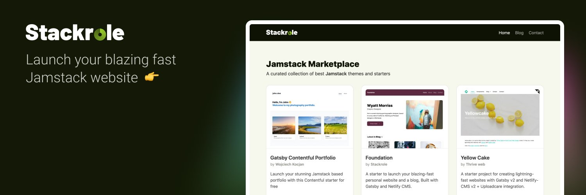

# Personal portfolio
With intagrated audio file CMS uplode and display functionality.

## 👌 Features
- A Blog and Personal website with Netlify CMS.
- Responsive Web Design
- Customize content of Homepage, About and Contact page.
- Add / Modify / Delete blog posts.
- Edit website settings, Add Google Analytics and make it your own all with in the CMS.
- SEO Optimized
- OpenGraph structured data
- Twitter Cards meta
- Beautiful XML Sitemaps
- Netlify Contact Form, Works right out of the box after deployment.
- Invite collaborators into Netlify CMS, without giving access to your Github account via Git Gateway
- Gatsby Incremental Builds with Netlify.
Added By GhostRicity
-Uploding and displaying audio files in Cards
-Single page layout

## 🙏 Thank you
[twitter]: https://twitter.com/stackrole
For giving me a great starter to work with and mold in to a musical jurny

[gatsby]: https://gatsbyjs.org
[netlifyCMS]: https://www.netlifycms.org
